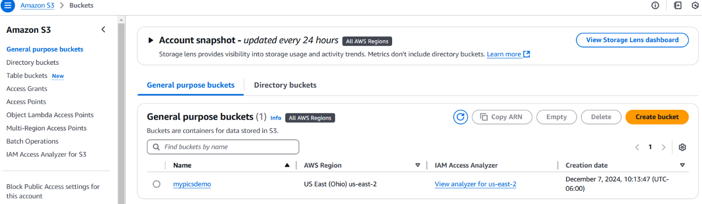
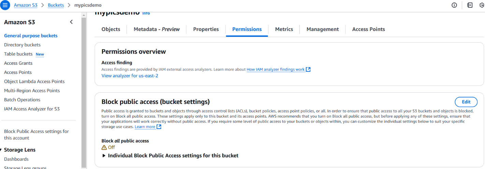
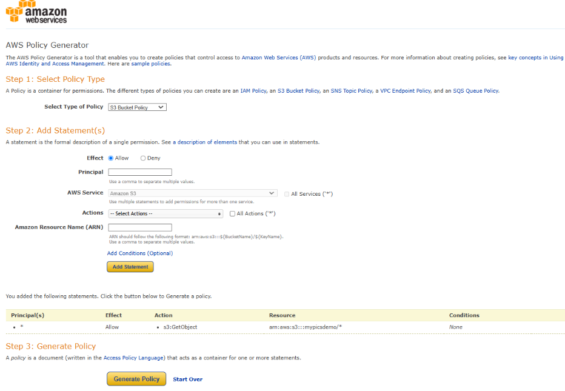
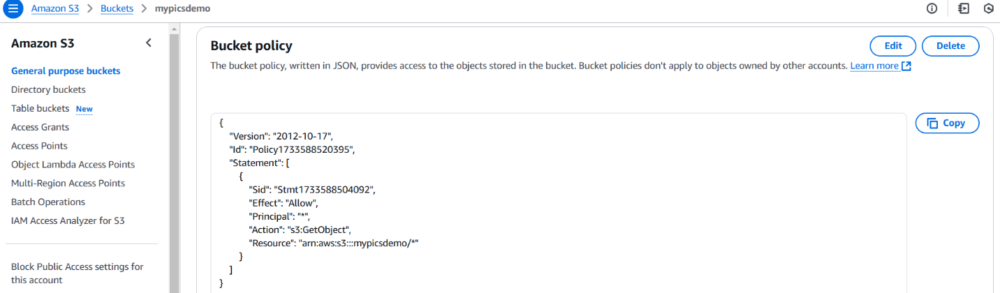
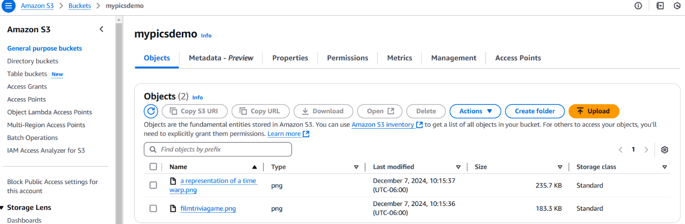
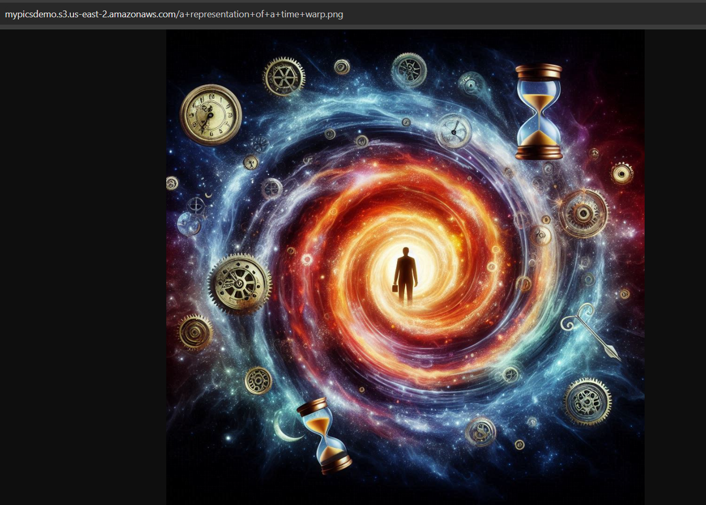

# How To Use AWS S3 (`Simple Storage Service`)

This document provides detailed steps for setting up an S3 bucket, configuring permissions, and hosting public images. Screenshots are included for reference, and key concepts are explained.

---

### **Step 1: Create an S3 Bucket**

1. **Sign in to AWS Management Console**  
   Go to the [AWS Management Console](https://aws.amazon.com/console/).

2. **Navigate to S3 Service**

   - In the search bar, type **S3**.
   - Select **Amazon S3** from the results.

3. **Create a New Bucket**
   - Click on **Create bucket**.
   - Enter a unique name for your bucket (e.g., `my-website-images-123`).
   - Select a **region** closest to your audience for better performance.
   - Leave the other settings as default and click **Create bucket**.

**Screenshot**: 

---

### **Step 2: Configure Bucket Permissions**

1. **Enable Public Access**
   - Open the bucket and navigate to the **Permissions** tab.
   - Scroll to **Block public access settings** and click **Edit**.
   - Uncheck **Block all public access** and confirm your changes.
   - Click **Save**.

**Screenshot**: 

2. **Set Up a Bucket Policy**
   - Scroll to the **Bucket policy** section and click **Edit**.
   - Use the **Policy Generator** tool to create your policy:
     - **Policy Type**: S3 Bucket Policy
     - **Principal**: `*`
     - **Actions**: `GetObject`
     - **ARN**: Format is `arn:aws:s3:::my-website-images-123/*` (replace with your bucket name).
   - Copy the generated policy and paste it into the **Bucket policy editor**.
   - Save your changes.

**Screenshot**:  

---

### **Step 3: Upload an Image**

1. **Go to Objects Tab**

   - Open the **Objects** tab in your bucket.

2. **Upload Your Image**
   - Click **Upload** and select an image file from your computer.
   - Click **Upload** to confirm.

**Screenshot**: 

---

### **Step 4: Get the Public URL of Your Image**

1. **Retrieve the URL**

   - After the image is uploaded, click on the file to open its details.
   - Copy the **Object URL**, which should look like:  
     `https://my-website-images-123.s3.amazonaws.com/your-image.jpg`.

2. **Test Accessibility**
   - Open the URL in a browser.
   - If the image loads successfully, your configuration is correct.

**Screenshot**: 

---

### **Key Concepts Explained**

#### **Bucket**

- A logical container in Amazon S3 where data, such as images or files, is stored. Each bucket must have a unique name globally.

#### **Policy**

- A JSON document that specifies permissions and defines who can access your bucket and its objects.

#### **ARN (Amazon Resource Name)**

- A unique identifier for AWS resources. Example: `arn:aws:s3:::my-website-images-123/*`. The wildcard (`*`) allows access to all objects in the bucket.

#### **Wildcard (`*`)**

- A character used in the ARN to represent "all resources." For example, `arn:aws:s3:::bucket-name/*` grants permissions to every object in the bucket.

---

### **Common Issues and Solutions**

1. **Image URL Not Loading**:

   - Double-check your **Bucket Policy** and ensure public access is enabled.

2. **Permission Denied Errors**:

   - Verify that you unchecked **Block all public access** and configured the policy correctly.

3. **Bucket Name Already Exists**:
   - Choose a globally unique name for your bucket.

---

### **Additional Notes**

- Use HTTPS for secure access to your images.
- Bucket policies can be edited anytime to adjust permissions.
- Test your setup using different browsers to ensure accessibility.

---

This concludes the S3 bucket setup guide. If you encounter any issues, refer to the AWS documentation or contact support.
